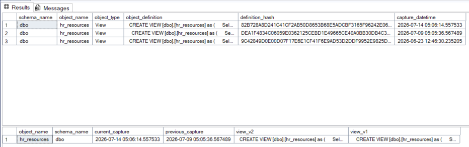
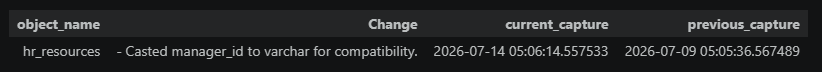

# Fabric View Auditor

Audits SQL view definitions in Microsoft Fabric by capturing daily snapshots, generating SHA-256 hashes of view definitions, and storing a new audit record only when a change is detected.

---

## Overview

Fabric View Auditor automatically tracks changes to SQL View definitions in a Microsoft Fabric Data Warehouse.

The solution consists of:

- Microsoft Fabric Notebook
- Microsoft Fabric Pipeline
- SQL Audit Table
- SHA-256 change detection

Instead of storing every daily snapshot, the solution inserts a new audit record only when a view definition changes.

---

## Solution Architecture

```text
SQL Views
    │
    ▼
Audit_ViewChanges Notebook
    │
    ├── Read View Definitions
    ├── Generate SHA-256 Hash
    ├── Compare Against Latest Version
    ▼
ViewDefinitionAudit Table
    │
    ▼
Historical View Versions
```

---

# Microsoft Fabric Pipeline

The pipeline executes the notebook on a scheduled basis to capture and audit SQL View changes.

---

# Audit History

The audit table stores each version of a view definition along with its SHA-256 hash and capture timestamp.



---

# Example Change Detection

When a SQL View definition changes, the solution compares the latest and previous versions and reports the differences.

Example shown below:

- View: `hr_resources`
- Change detected:
  - `Casted manager_id to varchar for compatibility.`



---

## Features

- Daily scheduled execution
- SHA-256 hashing
- Historical version tracking
- Detects new SQL Views
- Detects modified SQL Views
- Stores complete SQL definitions
- Ignores unchanged objects
- Built entirely on Microsoft Fabric

---

## How It Works

1. Read all SQL Views from `sys.objects`.
2. Retrieve view definitions from `sys.sql_modules`.
3. Generate a SHA-256 hash for each definition.
4. Compare the hash with the latest stored version.
5. Insert a new audit record only when a change is detected.

---

## Technologies

- Microsoft Fabric
- Fabric Data Warehouse
- Fabric Notebook
- Fabric Pipelines
- SQL
- SHA-256 Hashing

---

## Repository Structure

```text
fabric-view-auditor/
│
├── Audit_ViewChanges.ipynb
├── README.md
├── LICENSE
├── images/
│   ├── ViewAuditPipeline.png
│   ├── SqlTable.png
│   └── AI Summary Output.png
└── docs/
    └── Database Views Audit Table Spec.docx
```

---

## Future Improvements

- Stored Procedure auditing
- Function auditing
- Power BI dashboard
- Email notifications
- AI-generated change summaries
- Git integration

---

## License

MIT License